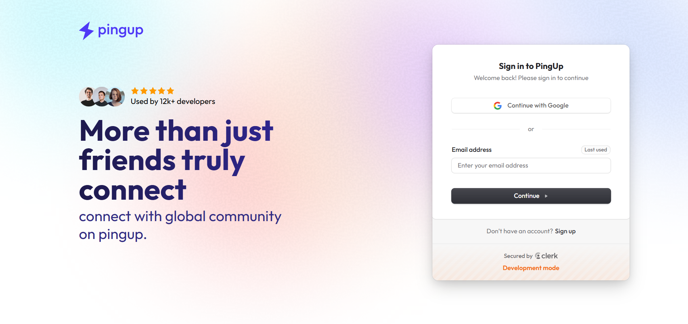
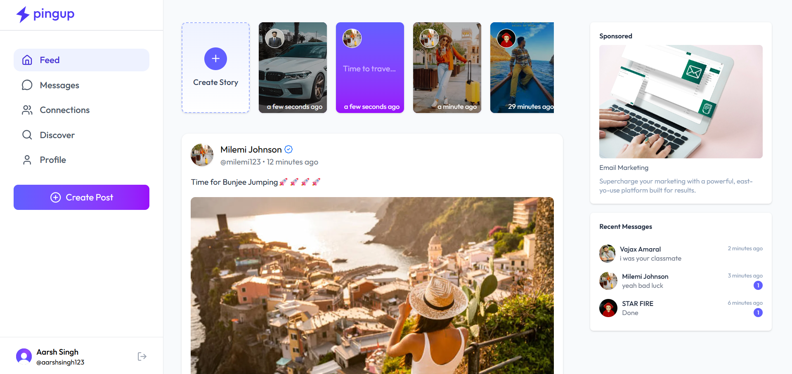
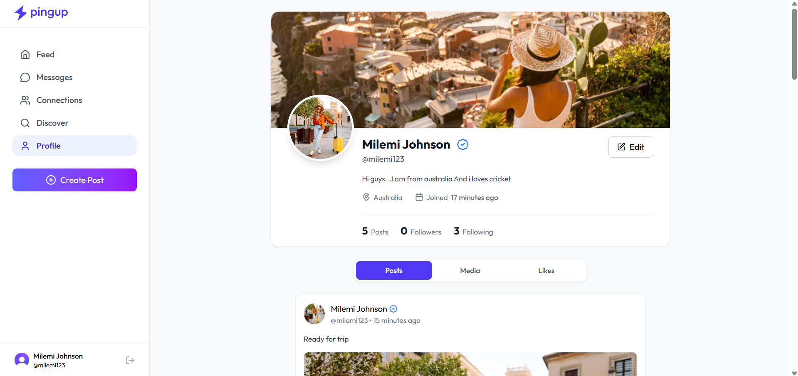
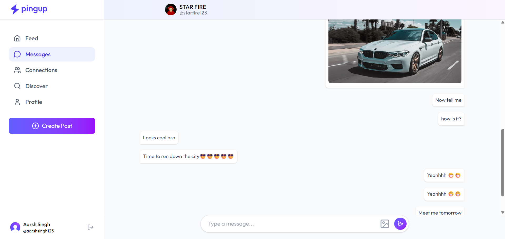
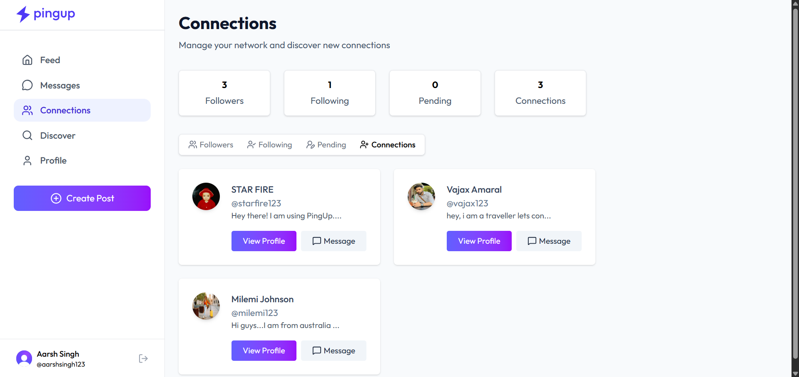
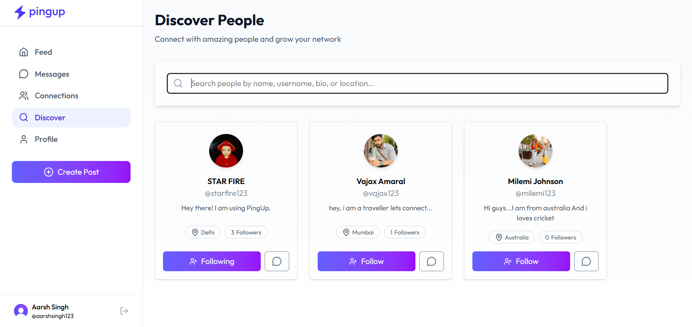

# 🚀 PingUp — Real-Time Social Networking Platform


- Built a **full-stack social networking platform** simulating real-world communication systems
- Designed and implemented **user discovery, social connections, and content sharing workflows**
- Developed **real-time messaging with live notifications** using Server-Sent Events (SSE)
- Focused on **system design principles** including layered architecture and state synchronization
- Implemented **event-driven workflows** for background processing and automation
- Engineered the application with a **production-oriented mindset**, handling real-world edge cases and data consistency

---

## 🌐 Live Demo

👉 https://aarsh-pingup.vercel.app/
 
---

## ✨ Why This Project Stands Out

- Implements **real-time messaging using Server-Sent Events (SSE)**
- Handles **social graph logic** (follow, connections, pending requests)
- Demonstrates **full-stack ownership** (UI → API → DB → real-time layer)
- Integrates **event-driven workflows (Inngest)** for automation
- Solves real-world issues like:
  - Auth ↔ DB sync
  - State consistency across features
  - Async updates & notifications

---

## 🧠 Core Features

### 🔐 Authentication & User Sync
- Secure authentication via Clerk
- Automatic user sync between Clerk and MongoDB
- Protected routes and session handling

---

### 👥 Social Graph System
- Follow / Unfollow users
- Send and accept connection requests
- Manage followers, following, and connections
- Real-time UI updates after actions

---

### 🏠 Feed System
- Personalized feed from connected users
- Create posts (text + images)
- Like / unlike functionality
- Optimized media handling via ImageKit

---

### 🔍 Discover Users
- Search users by name, email, or username
- Expand network dynamically

---

### 💬 Real-Time Messaging (Key Feature)
- One-to-one chat system
- Text and image messaging
- Real-time updates using SSE (no polling)
- Auto-scroll and message sync

---

### 🔔 Notification System
- Live toast notifications for incoming messages
- Smart detection of active chat vs background notifications

---

### ⚙️ Automation & Background Jobs
- Inngest-powered workflows:
  - User lifecycle sync
  - Story expiry
  - Email reminders
- Async processing for scalable operations

---

## 📸 Screenshots

A quick walkthrough of the core user experience and features of the platform:

---

### 🔐 Authentication (Login Page)
<p align="center">
  
</p>

> Secure authentication powered by Clerk with protected routes and session handling.

---

### 🏠 Feed (Social Timeline)
<p align="center">
  
</p>

> Central feed displaying posts from connected users with support for media and interactions.

---

### 👤 User Profile
<p align="center">
  
</p>

> Personalized profile with posts, connections, and user information.

---

### 💬 Real-Time Chat
<p align="center">
  
</p>

> Real-time messaging powered by SSE with instant delivery and notifications.

---

### 👥 Connections Management
<p align="center">
  
</p>

> Manage followers, following, and connection requests with real-time updates.

---

### 🔍 Discover People
<p align="center">
  
</p>

> Explore and connect with new users through dynamic search and discovery.


---

## 🛠️ Tech Stack

### Frontend
- React 19
- Vite
- Tailwind CSS
- React Router
- Redux Toolkit
- Axios
- React Hot Toast
- Lucide Icons

---

### Backend
- Node.js + Express
- MongoDB + Mongoose
- Clerk Authentication
- Inngest (event-driven workflows)
- ImageKit (media handling)
- Multer
- Nodemailer

---

## 🏗️ System Architecture

PingUp follows a modular, layered architecture:

Client (React + Redux)<br/>
↓ <br/>
API Layer (Axios + Auth)<br/>
↓ <br/>
Express Routes<br/>
↓ <br/>
Controllers (Business Logic)<br/>
↓ <br/>
MongoDB (User / Post / Message / Connection)<br/>
↓ <br/>
Real-Time Layer (SSE)<br/>
↓ <br/>
Async Jobs (Inngest)<br/>

---

## 🚧 Future Improvements

- Upgrade real-time communication from **SSE → WebSockets** for full duplex messaging and scalability
- Implement **pagination / infinite scroll** for feed, messages, and connections
- Add **push notifications** (browser + mobile support)
- Introduce **message delivery status** (sent, delivered, seen)
- Improve **caching strategy** (Redis) for feed and user data
- Implement **role-based moderation system** (report, block, restrict users)
- Add **image optimization & lazy loading** for better performance

---

## ⚡ Challenges & Learnings

### 🔄 Real-Time Messaging Synchronization
Handling real-time updates using **Server-Sent Events (SSE)** required careful management of active connections and UI state. Ensuring that messages update instantly without duplication or stale state was a key challenge.

---

### 🔐 Authentication vs Database Sync
One major challenge was maintaining consistency between **Clerk authentication** and MongoDB user records. Issues like missing users after database resets highlighted the importance of syncing external auth providers with internal data models.

---

### 🧠 State Management Complexity
Managing global state across features like feed, chat, and connections using Redux required careful structuring. Handling edge cases (e.g., empty states, async updates) improved understanding of real-world state flow.

---

### 🔗 Social Graph Logic
Implementing follow, connections, and pending requests required designing a consistent relationship model. Ensuring correct updates across followers, following, and connections was non-trivial.

---

### 📡 Conditional Notifications
Building a smart notification system that detects whether a user is actively in a chat or not required route-based logic and real-time event handling.

---

### 🐛 Debugging Real-World Issues
Several bugs (e.g., route mismatches, ID comparisons, missing data after DB reset) reinforced the importance of:
- Proper data validation
- Defensive coding
- Debugging with logs and network inspection

---

## 📦 Project Structure

```text
PingUp/
├── client/
│   ├── src/
│   │   ├── api/
│   │   ├── components/
│   │   ├── features/
│   │   ├── pages/
│   │   └── App.jsx
│
├── server/
│   ├── controllers/
│   ├── models/
│   ├── routes/
│   ├── middleware/
│   ├── inngest/
│   └── server.js
